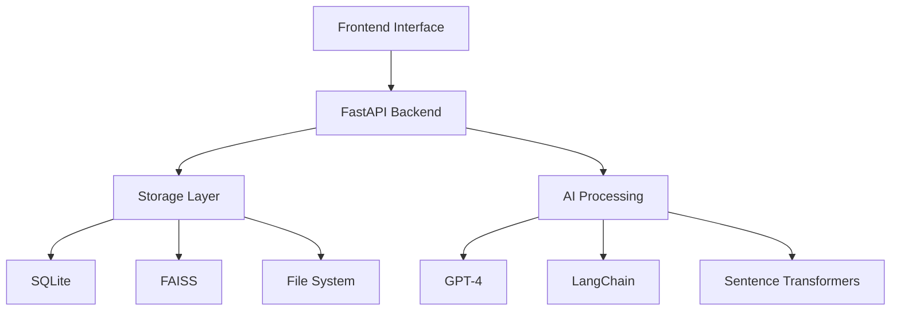
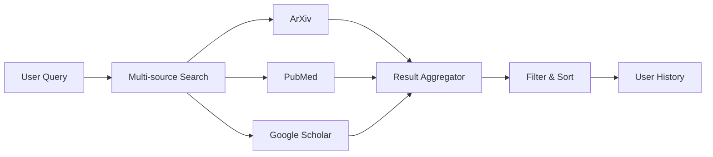
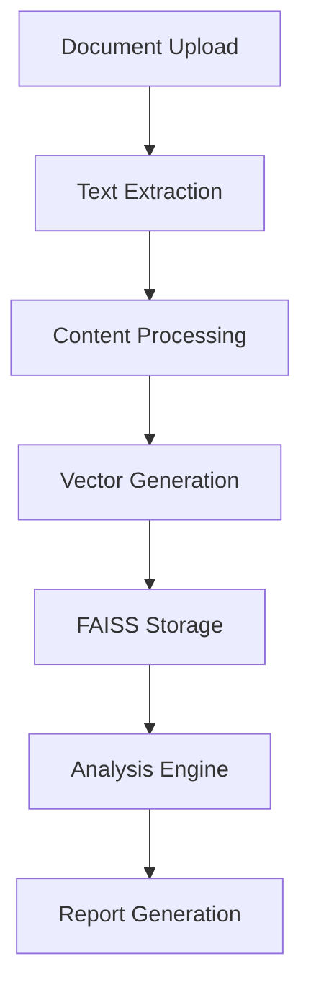
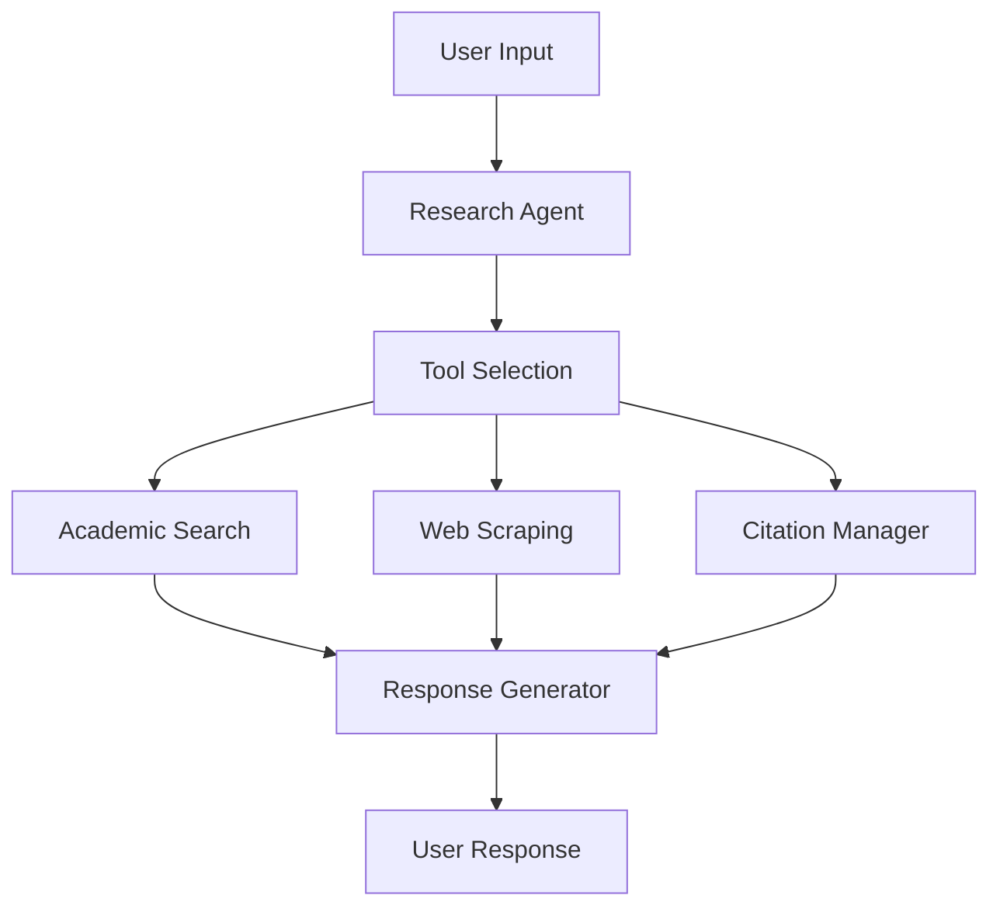
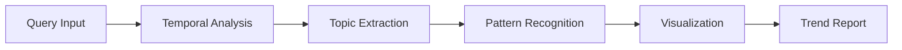

# 🎓 Academic Research Assistant

<div align="center">
  <h3>Your AI-Powered Research Companion</h3>
  <p>A sophisticated FastAPI-based platform that revolutionizes academic research through advanced AI, NLP, and vector search technologies.</p>
</div>

## 📑 Table of Contents
- [Core Features](#-core-features)
- [System Architecture](#-system-architecture)
- [Workflow Systems](#-workflow-systems)
- [Technical Components](#-technical-components)
- [API Reference](#-api-reference)
- [Setup Guide](#-setup-guide)
- [Usage Examples](#-usage-examples)

## 🌟 Core Features

### Document Intelligence
- **Advanced PDF Processing**
  - OCR-enabled text extraction
  - Multi-format support (PDF, TXT, URLs)
  - Intelligent content parsing

- **Vector Search**
  - FAISS-powered semantic search
  - Efficient embedding management
  - Fast similarity matching

- **Smart Analysis**
  - Context-aware QA system
  - Automated reference tracking
  - Citation management

### Research Tools
- **Trend Analysis**
  - Temporal research patterns
  - Topic evolution tracking
  - Publication analytics

- **Interactive Features**
  - Research-focused chat
  - Multi-source search
  - Comparative analysis
  - Custom report generation

## 🏗 System Architecture

### Core Components


### Backend Stack
- **Web Framework**: FastAPI with Pydantic
- **Database**: SQLAlchemy + SQLite
- **Vector Store**: FAISS
- **AI Models**: GPT-4, LangChain
- **Processing**: PyMuPDF, NLTK, Pandas

### Security Layer
- JWT Authentication
- Role-based access control
- Data encryption
- Session management

## 🔄 Workflow Systems

### 1. Search System


### 2. Document Analysis


### 3. Chat System


### 4. Trends Analysis


## 🛠 Technical Components

### Vector Processing
```python
class VectorStore:
    def store_embeddings(self, text: str, doc_id: str):
        embeddings = self.generate_embeddings(text)
        self.faiss_index.add_with_ids(embeddings, [doc_id])
        
    def search_similar(self, query: str, k: int = 5):
        query_vector = self.generate_embeddings(query)
        return self.faiss_index.search(query_vector, k)
```

### Document Processing
```python
class DocumentProcessor:
    async def process_document(self, file: UploadFile):
        content = await self.extract_text(file)
        chunks = self.create_chunks(content)
        embeddings = self.generate_embeddings(chunks)
        return await self.store_vectors(embeddings)
```

## 📡 API Reference

### Authentication
```http
POST /api/v1/auth/login
Content-Type: application/json

{
    "username": "researcher",
    "password": "secure_password"
}
```

### Document Analysis
```http
POST /api/v1/analysis/document
Authorization: Bearer <token>
Content-Type: multipart/form-data

file: research_paper.pdf
```

### Search Operations
```http
POST /api/v1/search
Authorization: Bearer <token>
Content-Type: application/json

{
    "query": "search papers on LLM",
    "filters": {
        "sections": ["Abstract", "Conclusion"],
        "word_limit": 200
    }
}
```

## 🚀 Setup Guide

1. **Clone Repository**
```bash
git clone https://github.com/Liberate-Labs/AI-Intern-Assignments/tree/main/academic-research-assistant%5Bhamim%5D/FastAPI%20Version.git
cd FastAPI Version
```

2. **Environment Setup**
```bash
python -m venv venv
source venv/bin/activate  # Unix
venv\Scripts\activate     # Windows
```

3. **Install Dependencies**
   ```bash
   pip install -r requirements.txt
   ```

4. **Configure Environment**
```bash
cp .env.example .env
# Edit .env with your configurations
```

5. **Initialize Database**
   ```bash
   python -m app.db.init_db
   ```

6. **Run Application**
   ```bash
uvicorn app.main:app --reload
```

## 📄 License

MIT License - See [LICENSE](LICENSE) for details

---

<div align="center">
  <h3>🌟 Ready to Transform Your Research?</h3>
  <p>Start using the Academic Research Assistant today!</p>
</div>


